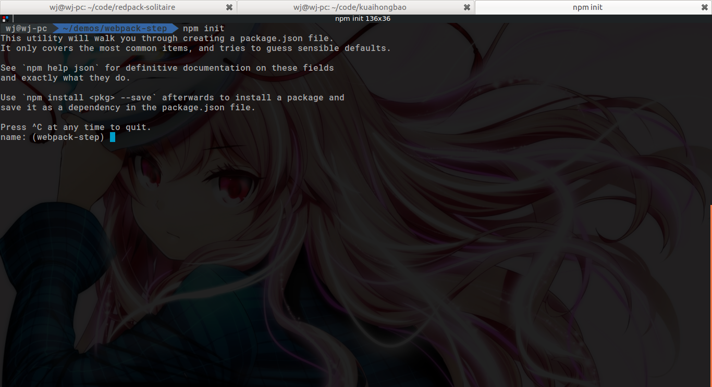
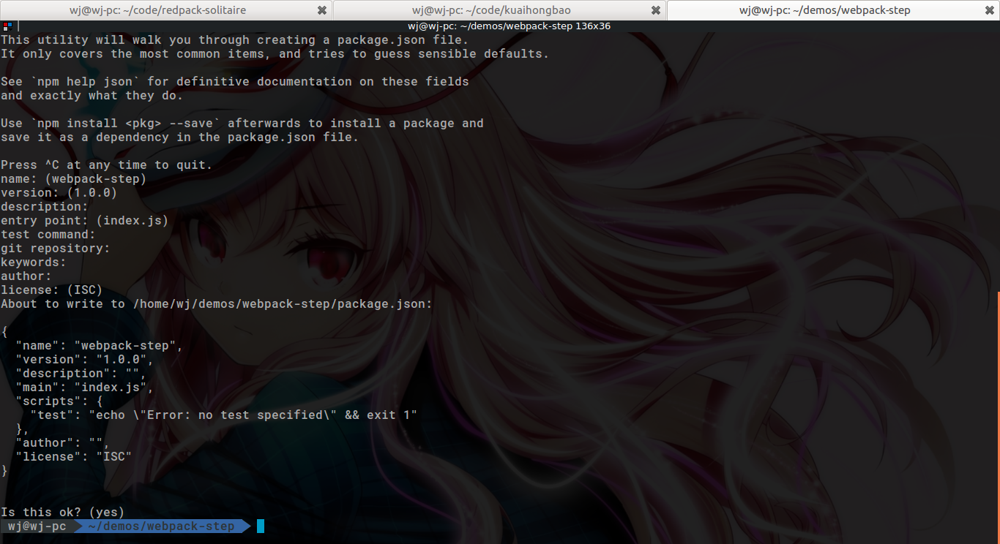

<!--!
{
  "title": "从零开始搭建webpack开发环境",
  "date": "2016-11-22",
  "class": "post",
  "tags": ["前端", "webpack"],
  "img": {
    "url": "http://ob54s56n6.bkt.clouddn.com/markdown2.png",
    "position": ["50%"]
  }
}
-->
相比于gulp那种结构清晰简单，一路task下来的工作流程而言，webpack的配置比较让人摸不着头脑，相信很多新人在一遍遍的阅读了官方教程和各种gitbook后，碰到一个写好的config文件（例如vue-cli的）依旧如同看天书一般（是的我就是这样）。究其原因，还是webpack的定制性太强，不仅插件多且杂，大部分的插件自己还有不少的属性要配置。各种配置混来混去，导致了webpack配置结构复杂，对新人不太友好。

其实，我们大可不必纠结于五花八门的插件，而是从头开始，搭建一个最原始的webpack环境，看看它的基本结构以及能够实现的最简单的功能，然后，再根据开发过程中的实际需要，一个一个地往上“安装”插件，在“安装”的过程中了解插件的功能及用法，同时保持着对整体结构的认知。这样，当以你后再看到一个新的config文件时，虽然里面可能有一大堆的插件你没有用过，但是你可以快速了解这个config的大体结构，以及每个插件的大致功能。随后再去逐个消化这些插件。

本文将从一无所有开始，搭建一个简单的webpack开发环境，实现以下功能：

1. js文件的打包，uglify，babel，eslint
2. css文件的打包，支持scss
3. html文件的打包，支持pug(jade)
4. 基于Express的开发服务器

## 0. 创建一个webpack项目

在一切的开始，我们需要创建一个npm项目，如下图所示：

```bash
npm init
```



按照提示，你可以进行一些项目的配置，这里就不赘述了。如果仅仅是做个demo，你也可以一路回车下来，如下图：


然后进入项目，我们可以发现…

除了一个```package.json```，什么都么得啊！！！

不要着急，现在我们建立的只是初始化的npm项目，要让它变成初始化的webpack项目，还得做一些微小的工作。

首先我们要安装webpack，建议全局和项目内都安装一个，全局安装：

```bash
npm install -g webpack
```

全局安装的webpack
